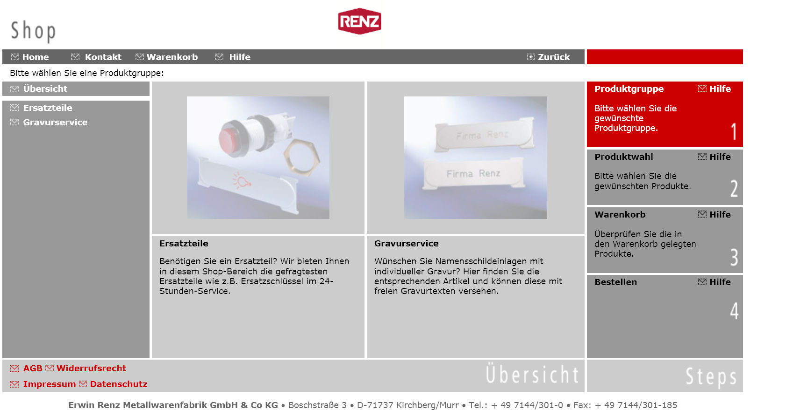
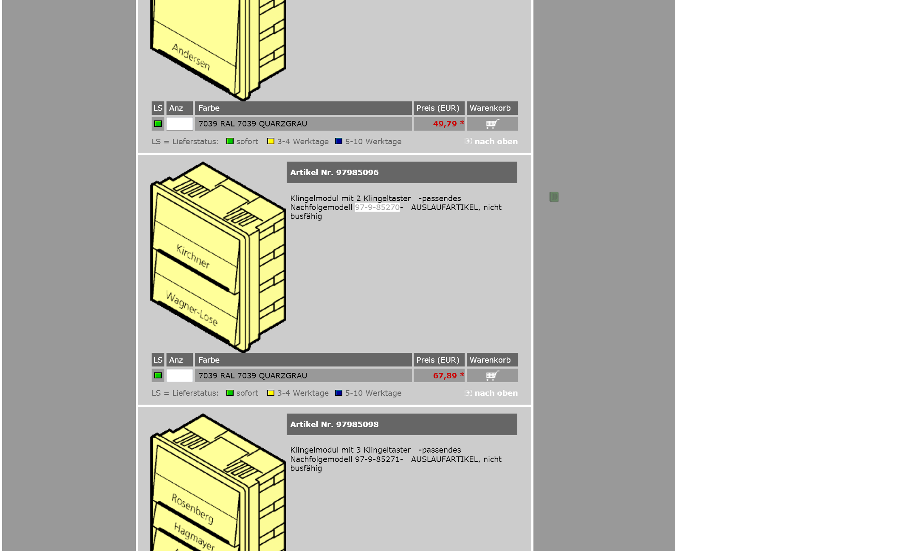
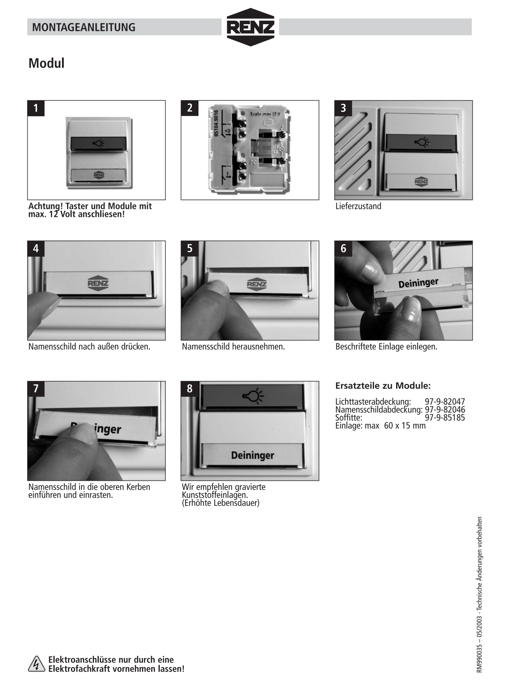
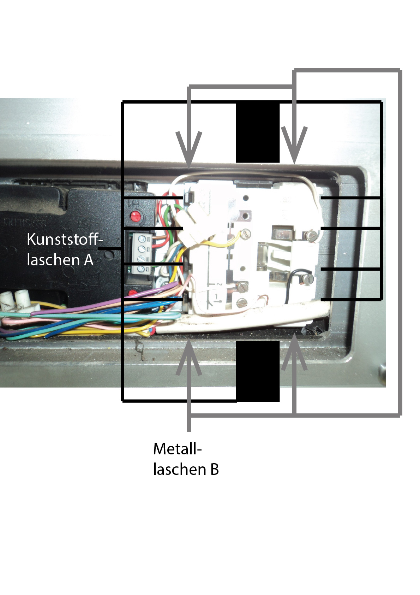
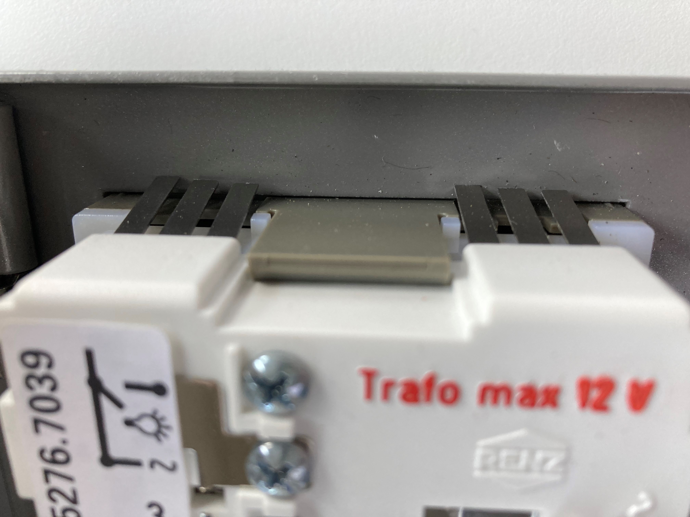

# Fickt euch, Bürger. Wir haben euch an den Eiern/Votze #

## Epilog ##
Diametral des Titels behandelt dieser Schwank **nicht** die Korruption und das Selbstbewusstsein, 
das Deutschen Herstellern im Türgewerbe (Also im wörtlichen Sinne ... Herstellern von Haustüren!)
inne wohnt, sondern die faszinierenden Trampelpfade menschlicher Kommunikation.

## Deep Knee in the Dead ##
Klar sicher. Alte **Klingel** kapott. Seit Jahren. Nun ist sie *GANZ* kaputt.

Also: Wir haben es mit dieser Scheisse aus (vermutlich) 2002er Web-Pornographie-Zeiten zu tun.
 

Eins, zwei oder drei? Nichts funktioniert, ausser Gross(**Ess Ess**) in der Mitte: **Ersatzteile**.

Lasst uns bestellen:
 

Und dann auschecken, aus diesem Irrenhaus:

Ja, Sicher! Die Servicepauschale, Corona-Abgabe und das "bringt eure Alten raus. Man kann sie wenden lassen!" Trinkgeld, sicher.

--------------------------------------------------------------------------------------------------------

Anbei meine Kommunikation mit den Frettchen:

Telefonat 09hundert, Gesprächsprotokoll:
***** LISTEN TO YOURRRRRRRR HEAAAAAAAAAAARTTTTT, LALALLAA LLALALLAAaaaaaaaaaaaaa LALALAAAAAAAAAAA ******
> J: "Ja? können sie mich hören?"

> R: "Wieso auch nicht?"

> J: "Ich habe ein technisches Problem, aehemm, wenn sie mich vielleicht verbinden könnten? Achja und bleiben sie gesund!"

> R: "Ihre Postleitzahl bitte"

> J: "XXXXX"

********** KLICKKKKK *******

> B: "Guten morgen, Busen"

> J: "WAS?"

> J: "Ach ich habe da ein technisches Problem mit ihren Klingeln. Also ich habe Ersatz für ein defektes Teil von 
> ihrer Firma und würde gerne wissen, ob es Spezialwerkzeug bedarf die 12 Metallaschen "innentürig" zu lösen?
> 
> B: "Kein Problem, geben sie mir ihre Mailadresse und ich schicke ihnen eine Einbauanleitung."

nach 5 angespannten Minuten: "NEIN, das ist NICHT SAMUEL THEODOR EMIL FRIEDRICH ADOLF NORDPOL IDA EMIL !!!!"   
( Hint: [Buchstabieren am Telefon auf Deutsch nach DIN 5009 (Buchstabieralphabet)](https://www.spelltool.com/de/](https://www.spelltool.com/de/) )

> J: "Vielen Dank für ihre Mühe."
> B: "Keine Ursache"

Ich bekomme Folgendes geschickt:

Zu der Zeit sind meine Fingernägel nicht weiss lackiert, sondern schwarz-rot, **BLUUUUT**. Ich lasse mir aber nichts anmerken. Nun ja, hübsche Fingernägel 
... was sehr wichtig sein mag, wenn frau Klingelschilder wechseln will. Red ich Stuss? Red ich Metall-Laschen?

## RETALIATION ! ##
*Email*

>> Vielen Dank für das Dokument Herr Busen.
>>
>> Wir haben uns allerdings Missverstanden. Ich möchte keine Klingelschilder tauschen, sondern das komplette Modul, 
>> das defekt ist. Ersatz ist vor Ort vorhanden.
>>
>> Anbei sende ich ein Bild, dass die Situation besser erklärt. Meine Frage ist nun, ob es eine Anleitung, bzw. 
>> Spezialwerkzeug benötigt um in der sehr engen Einbauumgebung das alte Modul herauszulösen.
>> 1) Kann ich durch Lösen der 10 "Kunststofflaschen A" (siehe Bild)  das Modul entfernen? Dies wäre in Richtung 
>> Innenseite (physisch in Richtung Fotograph, also mir), was das Entfernen der Kabel voraussetzen würde.
>> 2) Oder muss die Arretierung durch die 4 "Metall-Laschen B" gelöst werden um das Klingelmodul vermutlich in 
>> Richtung Außenseite zu entfernen?
>>
>> Falls Fall Nummer 2 eintritt ist es mir vermutlich durch die Enge des Einbaus nicht möglich das Modul zu lösen. Der Ausbau kann dann vermutlich nur destruktiv erfolgen ... was ja nicht weiter schlimm ist, da dass eingebaute Klingelmodul sowieso defekt ist.
>>
>> Ich bin leider nur XXX Fachrichtung YYYY und tätig in ZZZ und habe absolut keine Ahnung von Hausinstallation. Es würde mich sehr freuen, 
>> falls sie eine spezifische Anleitung für den Ein und Ausbau dieser Renz Tastenmodule 97-9-85270 hätten oder sie mir ihre fachliche Meinung 
>> zu den oben genannten (hoffentlich nicht all zu abstrusen Ideen) mitteilen können.
>>
>>
>> Vielen dank für ihre Mühe und mit besten Grüßen
>> SAMUEL THEODOR EMIL FRIEDRICH ADOLF NORDPOL IDA EMIL .... 
jaja .. Spass

Bild: 

## Suction ##

Er schickt mir dann als Volley:

>> Der Einbau auf Ihrem Foto ist nicht von Renz erfolgt!
>> Anbei Bilder über sachgemäßen Einbau, durch Wegdrücken der Federn mit Schraubendreher oder dünnes Blech kann das Modul entnommen werden
>>
>>
>>
>> Mit freundlichen Grüßen

Das Bild zeigt dann die selbe Armatur, nur mit etwas Spielraum, d.h. **wartungsfreundlich** eingebaut.:

Schönes Lehrstück. Für mich sehr hilfreich......
Die Hauptsache ist "**NICHT VON RENZ**" ...... aaaaaaaaaaaaaahhhhhhhhhhhhhhh wir sind nicht zuständig, hehehehehe:)

## Fazit ##

Ich komme mir grade so schrecklich vor. DER EINBAU IST NICHT VON KOMMISSAR RENZ ERFOLGT.

Ich habe keine Ahnung von Hausinstallation. Von Klingeln, Haustüren und so einem Scheiss schon gar nicht. Obwohl ich jahrelang 
in der Instandhaltung von euren Autos ... also den Maschinen, die eure Autos bauen, tätig war.

### Das Problem wurde dann so gelöst: ###

Mein Nachbar hat Erfahrung mit Hausinstallation. Ich konnte echt nicht hinschauen, als das alte Modul zerbrach. Gut, ich hatte 
zuvor mehrere Male gesagt, ich würde dieses "Teil" mit einer Hilti bearbeiten, weil es ja sowieso kaputt ist, aber ich habe keine Hilti.
Und ich bin nicht eine, die einfach alle (VERDAMMT) **"Kunststofflaschen A"** herausbricht. (Falls das unklar war -> so wird es gemacht!)

### An das technische Volk: ###
Legt bitte Wert darauf, dass ihr **vor** dem endgültigen Einbau die Funktion testet. Diese "Metallaschen B" verzeihen nämlich keine Fehler. 
Sie sind Diebstahlsicher. Wieso von Innen? Das weiss warscheinlich nur der Erfinder! :)

## Disclaimer ##

Dies gilt vorder- und meist für die enge Einbaulage in meiner Situation. 
Dieser Bautyp hat (wie auf den Bildern zu sehen) keinen Plan von moderner LED-Beleuchtung. Dazu sage ich hier gar nichts.

Mich persönlich würde es sehr freuen, wenn ihr einen Gedanken an die Menschen verschwendet, die eure Haustüren bauen. Ich weiss,
ein Haus baut Mann und Frau selten ... und dann ist es auch noch etwas besonderes. 

Genau in dieser Gedankenlücke leben die scheiss verfickten Schmarotzer von dieser Branche. Es sind nicht Drückerkollonnen, 
die niemals ein Problem mit dem Einbau eines Klingeltasters haben .... Nein, die Gefahr kommt von Innen. Das Scheiss Monopol
der Türhersteller, Türherstellerschergen ( die kennen sie persönlich, wenn sie bauen ) und Armaturen in Industriequalität.

## Community ##
Das ist für den Normalverbraucher sowieso nicht ........ Mir fällt dazu einfach kein Wort ein.

Falls ihnen etwas einfällt? Scheuen sie nicht, die Kommentarfunktion zu nutzen. Jaja ... was effektiv das Melden eines Bugs ist.

Vielen Dank für ihre Geduld.
Ihre SAMUEL THEODOR EMIL FRIEDRICH ADOLF NORDPOL IDA EMIL
Aeeeh, Jedzia:)

 

